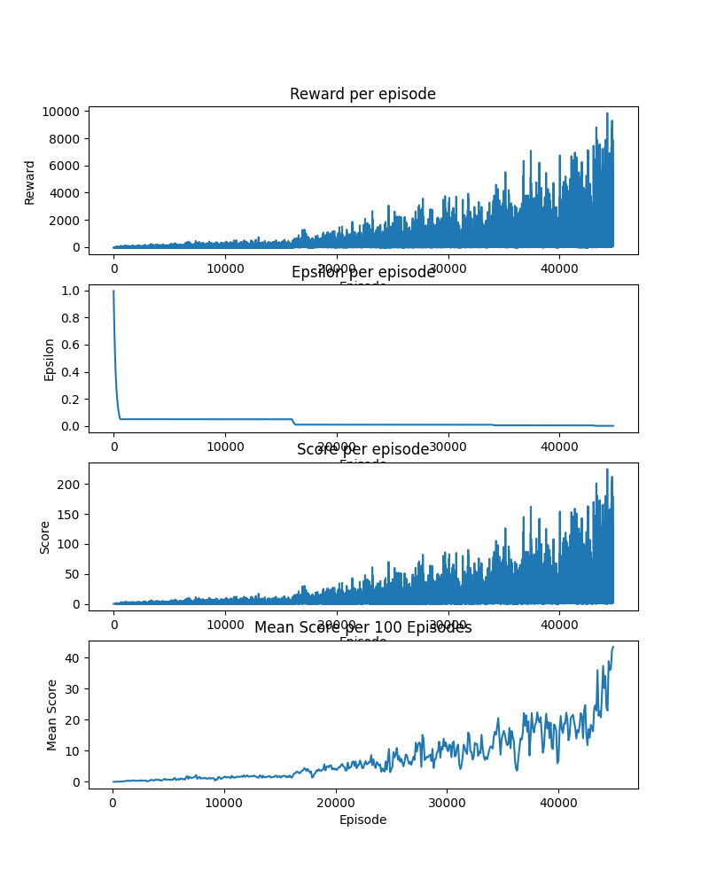
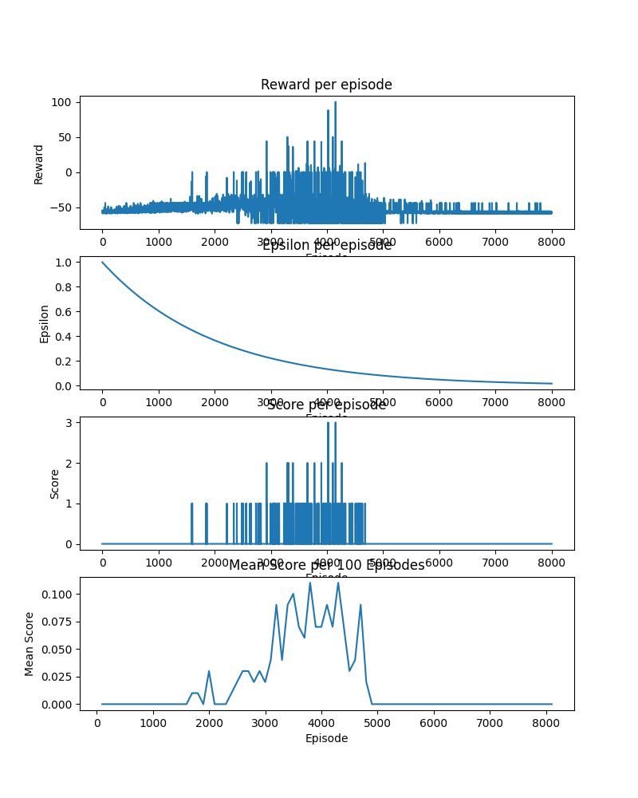

# Flappy Bot
I made this project to try and train an AI to play flappy bird.

# References
https://medium.com/@parsa_h_m/deep-reinforcement-learning-dqn-double-dqn-dueling-dqn-noisy-dqn-and-dqn-with-prioritized-551f621a9823

# Things I learnt
- Greedy-Epsilon
- DQN
- Double DQN
- Dueling DQN

# My journey

### Update
I made the game using pygame and started to look into DQN, but to be honest I have no idea what I am doing.

I implemented DQN, and trained the AI for a bit, and it got a highscore of 9 then I gave up a bit.

### Update
I then implemetned Double DQN and Dueling DQN and started to train the AI again.

### Update
I let the AI to train for quite some time with `epsilon = 0.05` and it stopped improving around the average score of 2,
I then set `epsilon = 0.01` and it instantly got to an average score of 3.69 within 1000 episodes


Training for quite some time after that, it stoped improving around the average score of 10,
and again I set `epsilon = 0.005` and it instantly got to 15 and breaking new records.


### Update
By this time, I also disabled rendering which gave me 360% performance

Doing the following also yields a 17% boost on top of that
```
import os
os.environ["SDL_VIDEODRIVER"] = "dummy"
```

Also used `pygame.display.set_mode((w,h), pygame.HIDDEN)`

After some testing, using dummy is better than just hidden, use both to get the best results

### Update
I lowered epsilon again to `0.001`



I then again lowered epsilon to `0.0001` and lowered decay rate to `0.9995`
Because I keep lowering the epsilon, I think I should try to implement `Noisy Networks`

### Update
I ended up trying the implementation from the thomashirtz's github repo https://github.com/thomashirtz/noisy-networks
with the help of deepseek I kinda got it to work but it is extremely slow, reducing the speed by x10, and I couldn't get the GPU to work for it,
so I'm putting it aside for now.

### Update
When using the current epsilon parameters directly to train a new model, it completly dies after the epsilon got low enough


I'm now gonna try Prioritized Experience Replay

### Update
After running the current best model, `flappy_dqn_481.pth`, 
I realized that there are lot of times where there is a low pipe gap followed by a high one,
despite the AI attempting to fly quickly to the high pipe gap, it failed to do so and crashed.


I feel like this might be the main cause of my AI plateauing at around `avg_score = 60`

After chaning the `PIPE_SPACING`, from `200` to `250` I instantly got maxed out reward of `100000` and Score of `1922`,
which basically means that my AI can run almost indefinitely without losing


At this point, I got the current best model using: 
- Double DQN
- Dueling DQN
- Manually tuning the `EPSILON_MIN` from time to time

It now sits at 54217 Episodes, which I believe I could greatly reduce with better techniques and hyperparameters.

Maybe I should test things out and log my total training time + episodes taken for different methods.