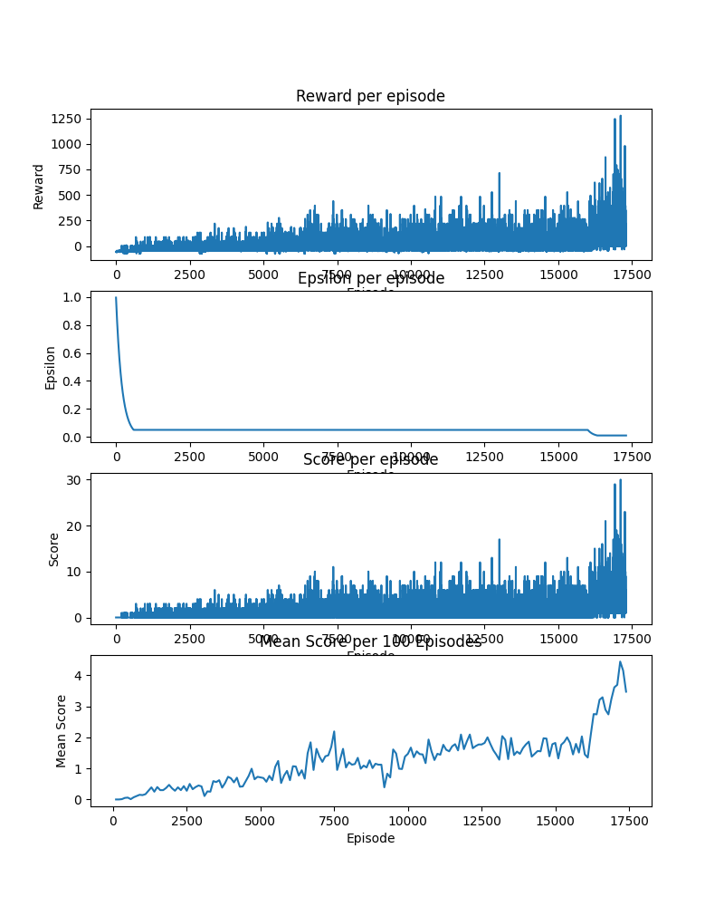
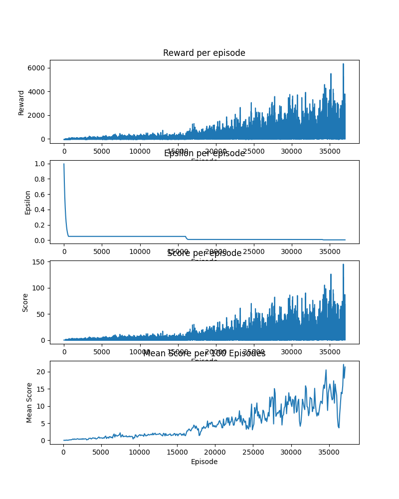

# Flappy Bot
I made this project to try and train an AI to play flappy bird.

# Things I learnt
- Greedy-Epsilon
- DQN
- Double DQN
- Dueling DQN

# My journey

I made the game using pygame and started to look into DQN, but to be honest I have no idea what I am doing.

I implemented DQN, and trained the AI for a bit, and it got a highscore of 9 then I gave up a bit.

I then implemetned Double DQN and Dueling DQN and started to train the AI again.

I let the AI to train for quite some time with `epsilon = 0.05` and it stopped improving around the average score of 2,
I then set `epsilon = 0.01` and it instantly got to an average score of 3.69 within 1000 episodes



Training for quite some time after that, it stoped improving around the average score of 10,
and again I set `epsilon = 0.005` and it instantly got to 15 and breaking new records.



By this time, I also disabled rendering which gave me 360% performance

Doing the following also yields a 17% boost on top of that
```
import os
os.environ["SDL_VIDEODRIVER"] = "dummy"
```

Also used `pygame.display.set_mode((w,h), pygame.HIDDEN)`

After some testing, using dummy is better than just hidden, use both to get the best results

I lowered epsilon again to `0.001`


I then again lowered epsilon to `0.0001` and lowered decay rate to `0.9995`
Because I keep lowering the epsilon, I think I should try to implement `Noisy Networks`